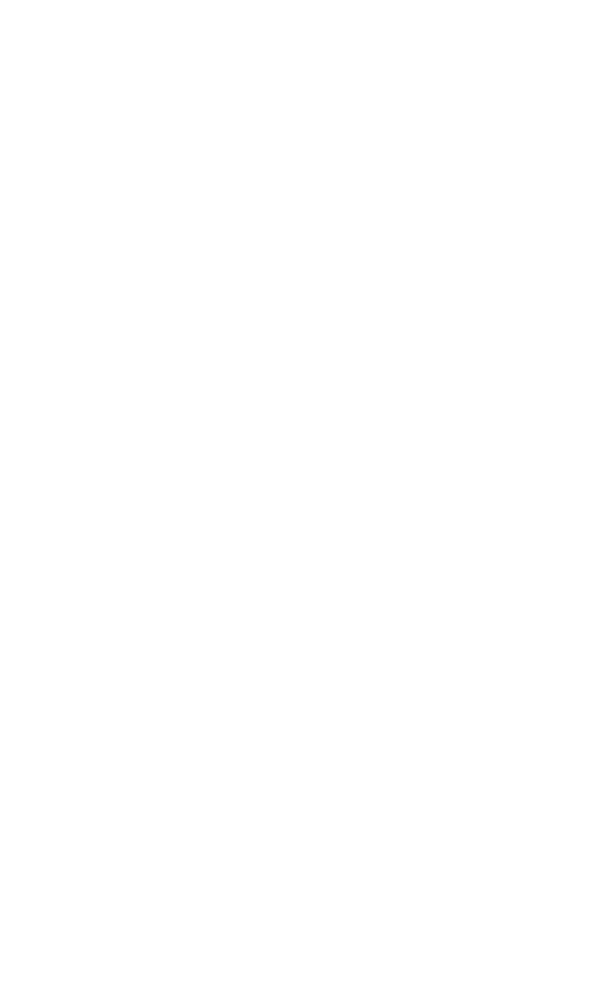
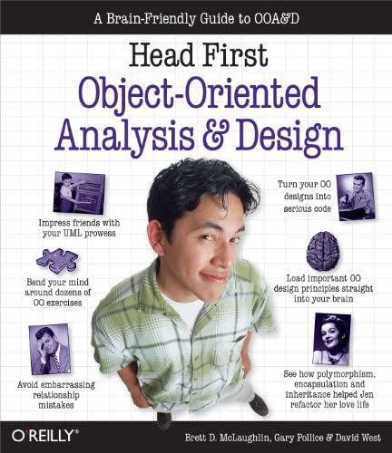

---
# Who Am I?
- bachelor of eng in eee.
- master's degree in etm.
- softare/r&d engineer.
- `denizmemis` @linkedin.com
- `d8niz` @github.com
- `deniz.memis` @eteration.com


---

# Object Oriented Programming

* objects
* classes
* inheritance
* abstraction
* hierarchies / taxonomies



---
# <!--  --> Story Time :)


---
# Alan Kay


Personal computing pioneer (see _Smalltalk_), holding a _Dynabook_ 💻

* _The best way to predict the future is to invent it._

* _Technology is anything invented after you were born._

* _The most disastrous thing that you can ever learn is your first programming language._

* _A change in perspective is worth 80 IQ points._

---

# OOPs #1: Human Cell Analogy


- Expectation:
  * Inheritance 
  * Taxonomy

- Reality:
  * `->`**Cells** 
     `-->` **Tissues** 
       `---->` **Organs** 
         `-------->` **Organisms**

---

# Contrast: Imperative (Procedural) Style


_"...a software development paradigm where functions are implicitly coded in every step required to solve a problem..."_

<!-- * Single unit
* Absolute coherence & harmony
* _Weak Link_ Theory -->

---

# Contrast: Object-Oriented Style


_"...a computer programming model that organizes software design around data, or objects, rather than functions and logic..."_

---

# OOPs #2: Big Idea


- Expectation:
  - Objects (!)
  - Classes (!)

- Reality:
  - **Messaging**
  - **Late-binding**

---

# Objects


* Say objects are like cells
* And big idea is messaging
* How do they even **communicate** ?

---

# Messages


- Dopamine (_look slightly right_)
- `Receptors` acting as communication agents
- Laying out the messaging protocol

--- 

# Systems


- What do you see here?
* Computers messaging thru an established protocol

* What do we get ?
  * Much larger and flexible system
  * Handles complexity
  * Handles scaling

---

# Typical OOP Syntax

<style scoped>
pre {
   font-size: 1rem;
   background-color: #000
}
</style>

```java
thing.do(some, stuff);
<rec> <---message--->
         <---args--->
```

- Email format:
```
- to: thing
- subject: urgent please :)
- message: 'do', some, stuff
```

---

# What does `do` do ?

<style scoped>
pre {
   font-size: 1rem;
   background-color: #000
}
</style>

```java
thing.do(some, stuff);
thing.do(other, stuff)
child.do(some, stuff)
thing.do(some, stuff)
```

* Late binding
* It is up to the `thing` (object || recipient) to `do` what to do :)
* Flexible
* Adaptable
* Tolerant to change

--- 
# <!--  --> End Of Story Time :)


---

# Four Pillars Of OOP


* **A**bstraction
* **E**ncapsulation
* **I**nheritance
* **P**olymorphism

---

# Abstraction
_"...the process of considering something independently of its associations or attributes..."_

- Hiding implementation details


<style scoped>
pre {
   font-size: 0.5rem;
   background-color: #000
}
</style>

```java
abstract class Bike{  
  abstract void run();  
}  

class HondaCB250R extends Bike{  
  void run()
  {
    System.out.println("running safely on a 250cc bike");
  }

  public static void main(String args[])
  {  
    Bike obj = new Honda4();  
    obj.run(); //running safely on a 250cc bike
  }  
}  
```

---
# Encapsulation
_"...the action of enclosing something in or as if in a capsule..."_

- Bundling the data along with the behaviior
* Facilitates the state management, keeps thing organized, allows read/write access management

<style scoped>
pre {
   font-size: 0.5rem;
   background-color: #000
}
</style>

```java
class Person {
  private int age;
  private String name;
  private String surname;
  private float salary;
  private String pob;
  private String dob;

  public Person(name,surname){...}

  public int getAge(){...}
  public void setAge(int age) {...}
  .
  .  
  public float calculateSalary(int age, String dob) {...}

}
```

---

# Inheritance
- Some classes may share commonalities
  - For example HomePolicy, AutoPolicy, LifePolicy classes may all have same state and behavior
- Instead of repeating commonalities in each class, we can abstract them in a common place
- These commonalities can be stored in a super class
- Each subclass inherits state and behavior from its superclass


---

# Inheritance (cont'd)

<style scoped>
pre {
   font-size: 0.5rem;
   background-color: #000
}
</style>

```java
public class Main {
	public static void main(String[] args) {
		Calc calc = new Calc();
		System.out.println("sum: " + calc.add());

		Calc calcWihParametricConstuctor = new Calc(1, -2);
		System.out.println("sum: " + calcWihParametricConstuctor.add());

		AbsoluteCalc absCal = new AbsoluteCalc(1, -2);
		System.out.println("abs sum: " + absCal.add());
	}
}

class Calc {
	private int first;
	private int second;

	public Calc(int first, int second) {
		this.first = first;
		this.second = second;
	}

	public int add() {
		return this.first + this.second;
	}
}

class AbsoluteCalc extends Calc {

	public AbsoluteCalc(int first, int second) {
		super(first, second);
	}

	@Override
	public int add() {
		return Math.abs(this.getFirst()) + Math.abs(this.getSecond());
	}
}
```

---

# Polymorphism

- Different objects respond to the same message in different ways
  - For example when asked to talk a dog barks, and a cat meows
- It is often supported by method overriding
  - Overriding means that subclass may implement the same method as superclass, but with different code
  - `toString()` method in the Object class is an example of often overridden method


---




